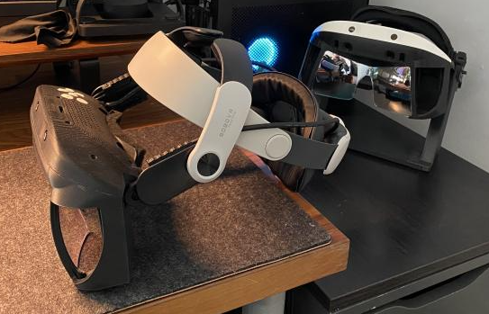
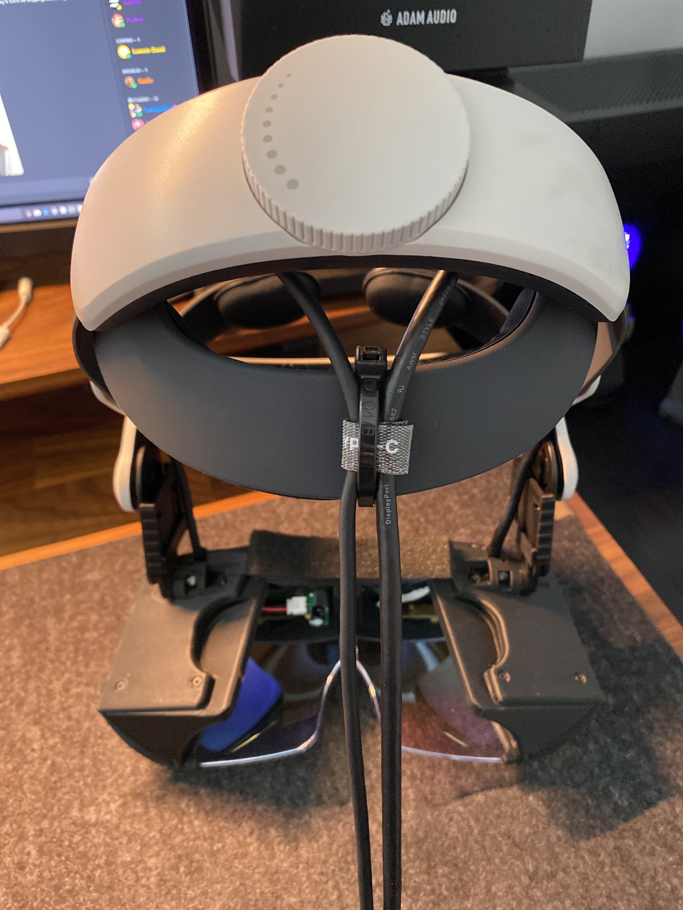

# BoboVR Headgear Adaptor 
These allow for the use of the BoboVR M2 headgear with the Deck X. 

Designed and shared by Noah Zerkin:
> Adapters for a relatively inexpensive Bobo clone / derivative. Had to cut and grind down the slide receivers on that headgear. Want to make one more tweak tomorrow and will post. Ergonomics aren’t bad, even without the foam forehead pad that’s missing from this one. Adjustability isn’t as smooth or clever as FLZero’s, but there’s actually a little more of it in terms of vertical repositioning, and slides out at least far enough to accommodate my glasses.

-- @noazark | Project North Star Discord Server | [#3d-printing](https://discord.com/channels/456107915514871828/456857961344532492/1007685576348151900)  |  August 2022

## What to print
`BoboAdapterL.stl`, for the left side, then again but flip on the x-axis for the right side.

## What to buy 
BoboVR M2 Plus (model without the battery) [[Amazon]](https://www.amazon.co.uk/dp/B0B2RP1N4F?psc=1&ref=ppx_yo2ov_dt_b_product_details) [[AliExpress]](https://www.aliexpress.com/item/1005002603950456.html?pdp_npi=2%40dis%21GBP%21%EF%BF%A1128.91%21%EF%BF%A197.28%21%21%21%21%21%40211b5e2216837427439044000ed3e8%2112000029657337934%21btf&_t=pvid:fa3b44d5-9a29-4a37-8afc-d58acfa30403&afTraceInfo=1005002603950456__pc__pcBridgePPC__xxxxxx__1683742744&spm=a2g0o.ppclist.product.mainProduct)

## Assembly
1. Add the hex screws provided with the Deck X kit into the adaptors.
2. Connect the adaptors to each side of the headgear 
3. Tighten the new headgear to the optics bracket via the hex screw
4. Adjust fit using adaptor angle and tightness to bring optics bracket closer to the face.

## Photos

| Images | Description |
:----------:|:-------------:
 | BoboVR Deck X with <a href="">Bollé Welding Headgear</a> Deck X in the background on an original calibration stand
 | Cable view of the BoboVR with Velcro & zip tie solution
