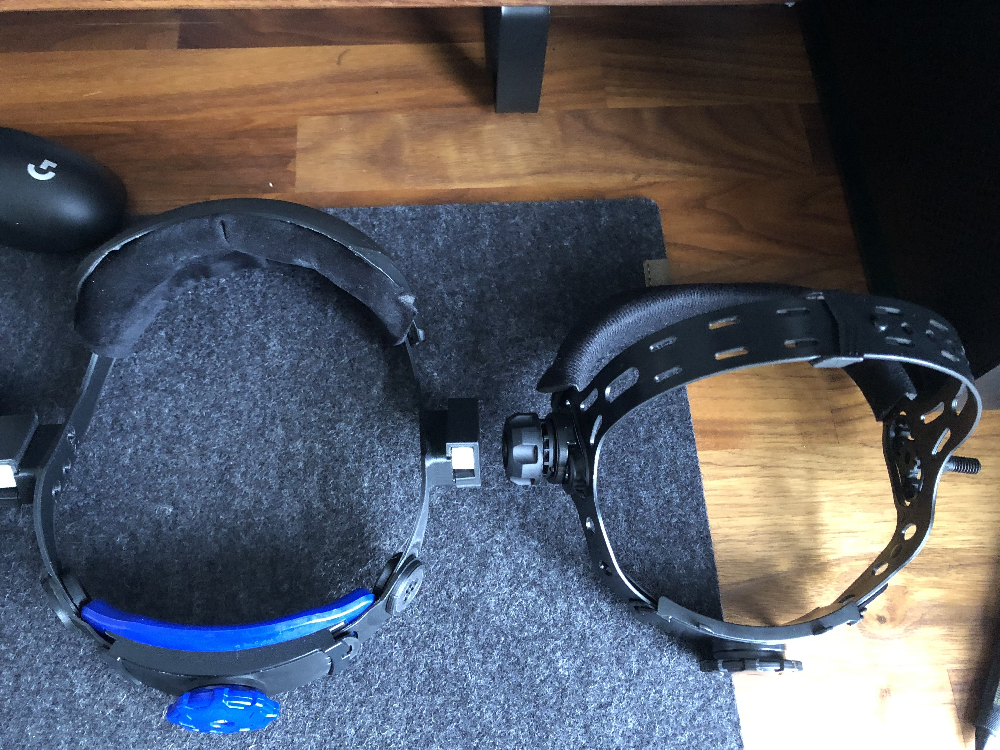
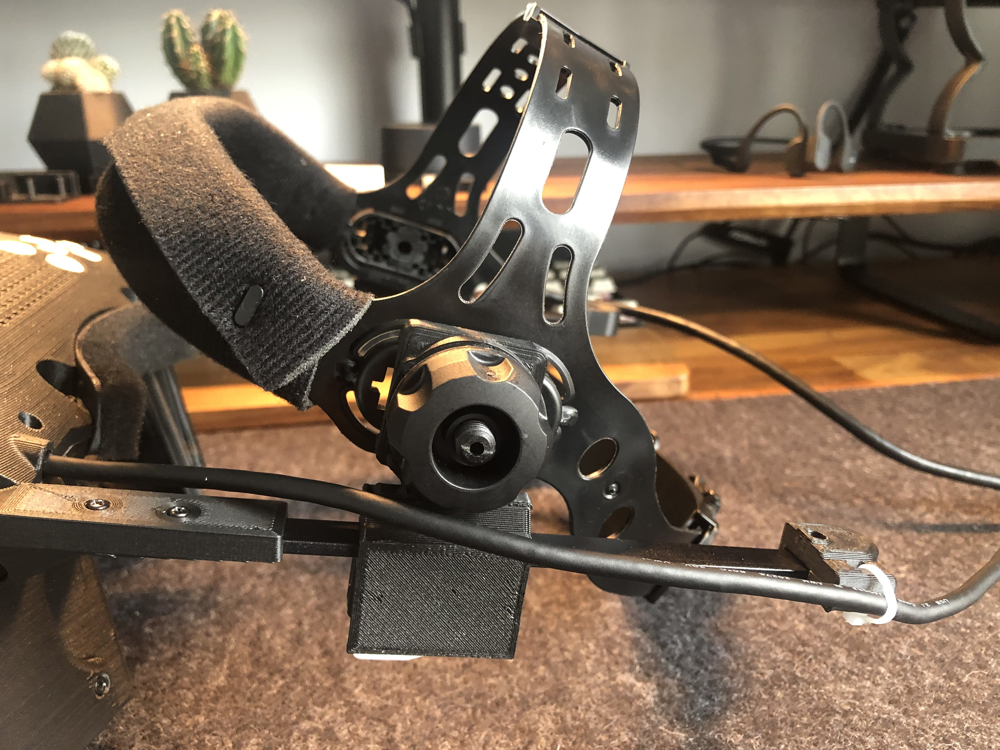
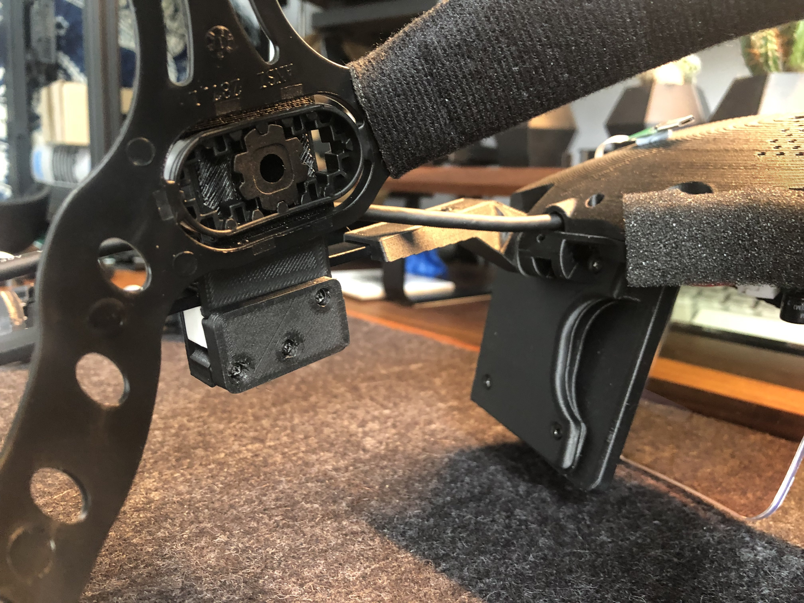
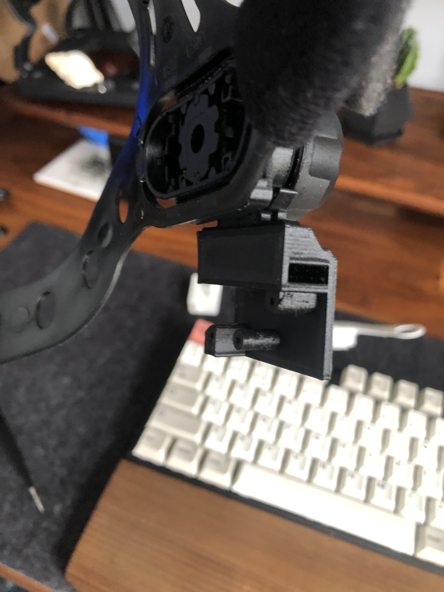
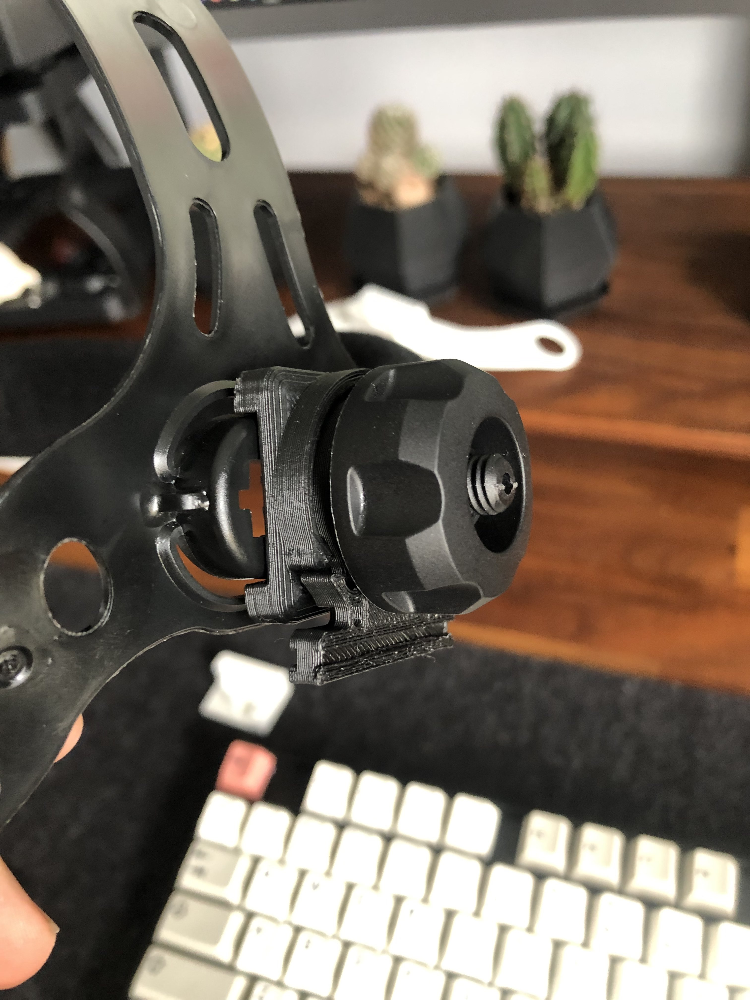

# Welding Headgear Adaptor 
These files help use a welding headgear with the Deck X. This is particularly helpful if you have a smaller head, as the Miller Gen II mechanism used in the Deck X does not tighten up _that_ much. This was a finding of a [user study](https://doi.org/10.21428/92fbeb44.8abb9ce6) that I carried out in October 2021. Another benefit is that it allows you to flip the headset up when not in use (the head padding rests on top of the forehead padding of the Deck X, stoppping it from slipping back down).

They were mainly designed by Juraj Vincur, I added the rail attachment mechanism onto the existing Deck X brake housing.

## What to print
Everything twice, but flip on the x-axis the brake housing, brake cover, and mount. (denoted with \_L in their names)
Additionally, you will need the brake_L/R from the original Deck X .stl files.

## Print Settings
- PolyTerra PLA at 210C on a 60C bed
- 0.12 Height
- 100% Infill

## What to buy 
The headgear I used: Bollé Adjustable Headgear for Flash Helmet [[Amazon]](https://www.amazon.co.uk/Boll%C3%A9-Adjustable-Headgear-Flash-Helmet/dp/B01GH48KZE/) [[eBay]](https://www.ebay.co.uk/p/4002443247)

## Explanation Video

## Assembly Images

| Images | Description |
:----------:|:-------------:
 | Comparison of Miller Gen III and Bollé Headgear
 | Side view of the Bollé headgear on the North Star
 | Inside view of brake cover attached
 | Inside view of brake housing attached to mount and rail
 | Image of the mount and rail attachment

